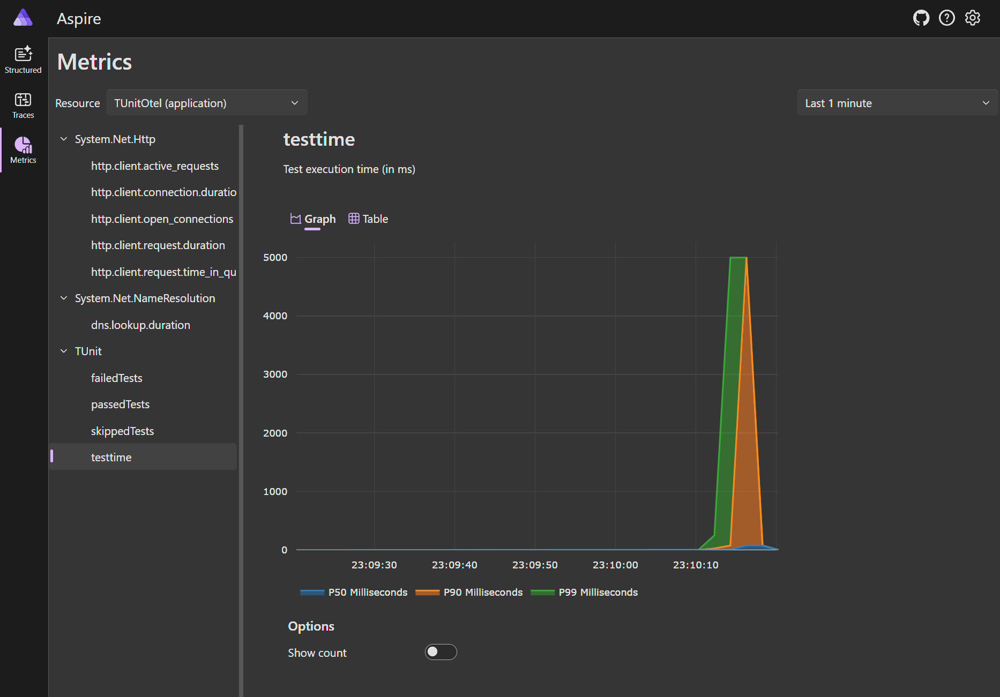
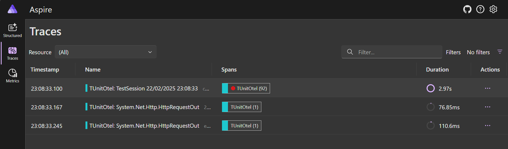
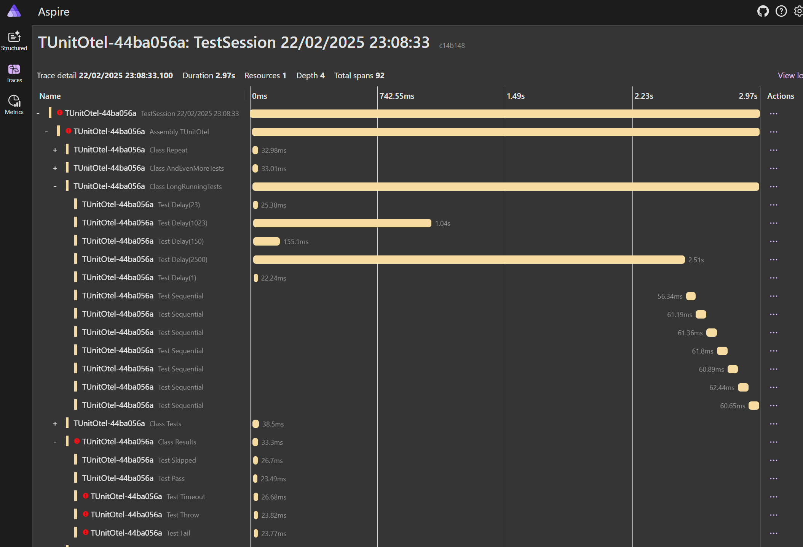

An exploration of exporting test results from TUnit as Open Telemetry.

Right now traces work to show the overall flow of tests and their containing classes.
However traces within tests do not get properly linked back to the test as the the way hooks are run doesn't persist `Activity.Current`.  (i.e. if a test makes an http call to `http://google.com/` that call doesn't properly get linked back to the Test span.)

## Exporting OTEl to aspire

The most light weight way to view otel is with teh [Aspire standalone dashboard](https://learn.microsoft.com/en-us/dotnet/aspire/fundamentals/dashboard/standalone?tabs=bash)
```powershell
docker run --rm -it `
     -p 18888:18888 `
     -p 4317:18889 `
     mcr.microsoft.com/dotnet/aspire-dashboard:9.0
```
Open the dashboard from the link in the console output

```
info: Aspire.Dashboard.DashboardWebApplication[0]
      Login to the dashboard at http://localhost:18888/login?t=8ac594ddd804203c86a9011ec55ca79c. The URL may need changes depending on how network access to the container is configured.
```

Now run the project
```powershell
dotnet run --project TUnitOtel.csproj
```

Now go to aspire and look at the 








## Exporting Otel elsewhere

1. Set the appropriate `OTEL_*` environment variables (see https://opentelemetry.io/docs/specs/otel/configuration/sdk-environment-variables/) in `Properties/launchsettings.json`
2. Run the app `dotnet run --project TUnitOtel.csproj`